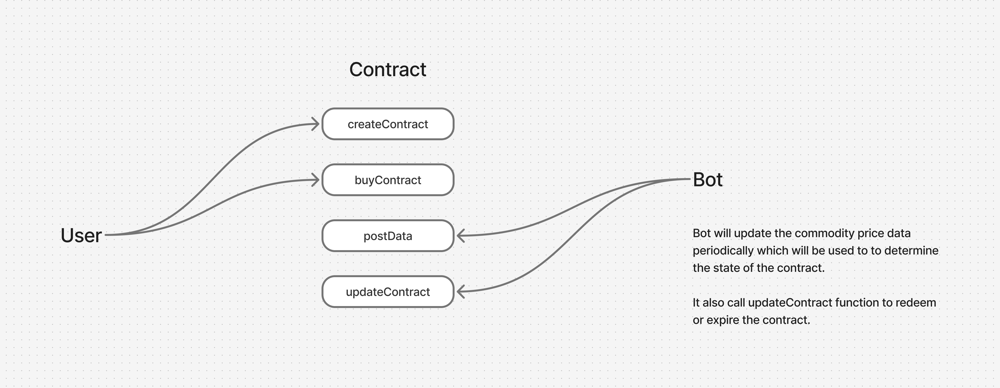
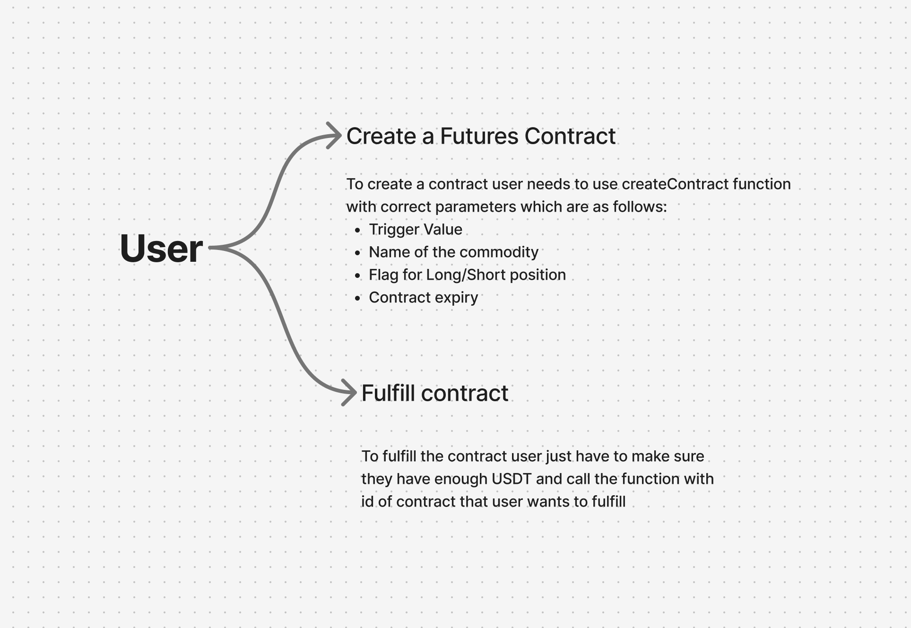
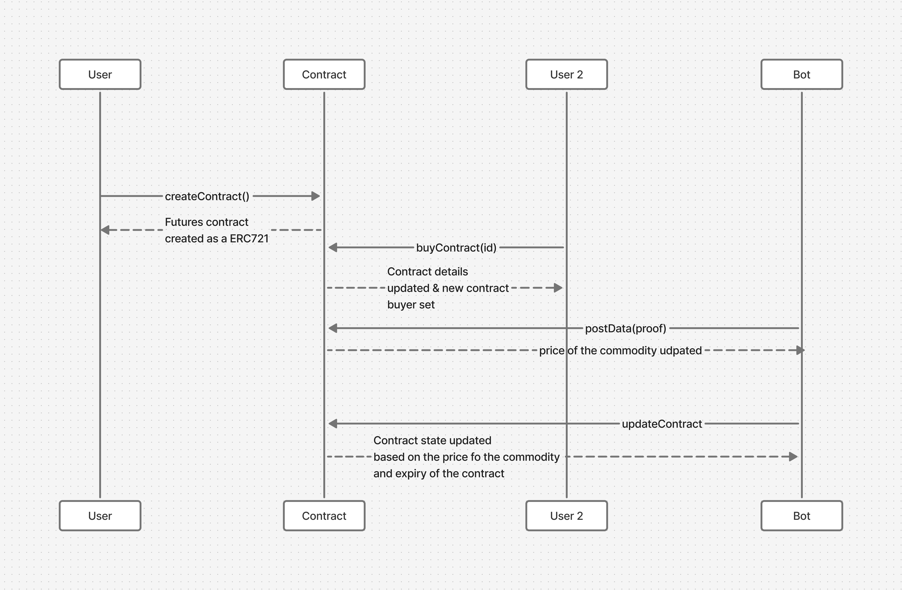

# Omega Futures

Trade any commodity you like, from potatoes to butter, with ease. Built using Flare FDC, Hardhat, and Next.js on the Flare Coston 2 Testnet.

## Project Structure

The project is organized like this:

```
.
├── contracts
├── scripts
└── test
```

## Run the Project Locally

Start by cloning the repository with this command:

```bash
git clone https://github.com/ashishbhintade/flare-futures-contract
cd OmegaFutures
```

### Smart Contracts

Install the dependencies for the contracts:

```bash
yarn
```

Run the tests:

```bash
yarn hardhat test
```

Compile the contracts:

```bash
yarn hardhat compile
```

## Live Demo

You can try the live demo here: [https://vercel.com/](https://vercel.com/)

## Architecture

The application has three main parts:

- User
- Bot (which sends updates to the contract through FDC)
- Contract

### Interaction with the Contract

The following diagram shows how users and the bot interact with the contract:



### User Interaction

Here is more detail about how users interact with the contract and what each function does:



### Full Contract Flow

The diagram below shows the full flow of how the user, bot, and contract interact step-by-step:


